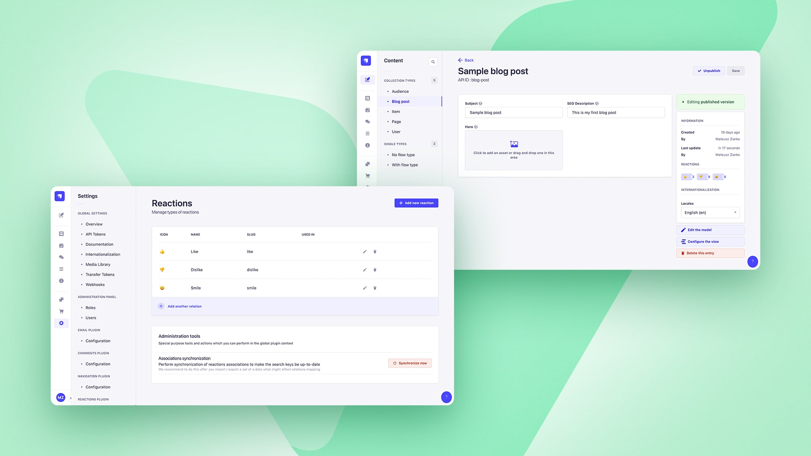

<div align="center" width="150px">
  
</div>
<div align="center">
  <h1>Strapi - Reactions plugin - Beta v5</h1>
  <p>All-in-One reactions plugin for any Content Type. Simple & flexible</p>
  <a href="https://www.npmjs.org/package/strapi-plugin-reactions">
    
  </a>
  <a href="https://www.npmjs.org/package/strapi-plugin-reactions">
    
  </a>
  <a href="https://circleci.com/gh/VirtusLab-Open-Source/strapi-plugin-reactions">
    
  </a>
  <a href="https://codecov.io/gh/VirtusLab-Open-Source/strapi-plugin-reactions">
    
  </a>
</div>

## ⚠️ This is the beta version for Strapi v5

---

<div style="margin: 20px 0" align="center">
  
</div>

A plugin for [Strapi Headless CMS](https://github.com/strapi/strapi) that provides flexible &amp; configurable reactions experience to any Content Types.

### Table of Contents

1. [💎 Versions](#-versions)
2. [✨ Features](#-features)
3. [⏳ Installation](#-installation)
4. [🖐 Requirements](#-requirements)
5. [🔧 Configuration](#-configuration)
6. [🕸️ Public API - REST](#%EF%B8%8F-public-rest-api-specification)
7. [🕸️ Public API - GraphQL](#%EF%B8%8F-public-graphql-api-specification)
8. [🔌 Enrich service for Strapi extensions](#-enrich-service-for-strapi-extensions)
9. [💬 FAQ](#-faq)
10. [🤝 Contributing](#-contributing)
11. [👨‍💻 Community support](#-community-support)

## 💎 Versions
- **Strapi v5** - (current) [v2.x](https://github.com/VirtusLab-Open-Source/strapi-plugin-reactions/tree/v5)
- **Strapi v4** - [v1.x](https://github.com/VirtusLab-Open-Source/strapi-plugin-reactions)

## ✨ Features

- **Public REST & GraphQL API:** Listing, setting, unsetting, toggling and much more via *REST* or *GraphQL* API. Easy to integrate with.
- **Any Content Type relation:** Reactions can be used to any of your Content Types without any special configuration.
- **Emoji &amp; Image reactions:** You can define reaction types using predefined set of [Emoji](https://github.com/ealush/emoji-picker-react) or use your own.
- **Content Manager Injection Zone:** Making use of Strapi built-in batteries like *Injection Zones* to provide you highers user experience. Visual representation of reactions counter for any Content Types - useful!
- **Developer Experience boosted:** A dedicated *Enrich* service provided to let you extend your Content API controllers by a single line to get reactions per each!
 
### Current backlog
Before releasing the RC and first Public Release we would like to introduce:

- ✅ Injection zone summary component for Content Manager edit view - [backlog](https://github.com/VirtusLab-Open-Source/strapi-plugin-reactions/issues/3)
- ✅ GraphQL API support - [backlog](https://github.com/VirtusLab-Open-Source/strapi-plugin-reactions/issues/1)
- ✅ Associations sync - [backlog](https://github.com/VirtusLab-Open-Source/strapi-plugin-reactions/issues/7)
- ⌛ Examples created in [strapi-examples](https://github.com/VirtusLab/strapi-examples)

**Request a feature by [raising an issue](https://github.com/VirtusLab-Open-Source/strapi-plugin-reactions/issues/new).**

## ⏳ Installation

### Prerequisites

#### Database connection update

Because of Emoji usage, you will need (or maybe you already did it because of earlier requirements) to extend the database connection section in your Strapi project configuration.

```ts
// config/database.ts
// config/<env>/database.ts

connection: {
    charset: 'utf8mb4',
    collation: 'utf8mb4_unicode_ci',
    // your database credentials
}
```

Based on this specific charset, your emoji reactions are going to be saved in the database like a charm. See the [reference issue](https://github.com/strapi/strapi/issues/10676#issuecomment-1642204275) raised on Strapi repository.

### Via command line

(Use **yarn** to install this plugin within your Strapi project (recommended). [Install yarn with these docs](https://yarnpkg.com/lang/en/docs/install/).)

```bash
yarn add strapi-plugin-reactions@latest
```

After successful installation you've to re-build your Strapi instance. To archive that simply use:

```bash
yarn build
yarn develop
```

or just run Strapi in the development mode with `--watch-admin` option:

```bash
yarn develop --watch-admin
```

The **Reactions** plugin should appear in the **Settings** section of Strapi after you run app again.

As a next step you must configure your the plugin by adding types of reactions you want to use. See [**Configuration**](#🔧-configuration) section.

All done. Enjoy 🎉

## 🖐 Requirements

Complete installation requirements are exact same as for Strapi itself and can be found in the documentation under [Installation Requirements](https://docs.strapi.io/developer-docs/latest/getting-started/introduction.html).

**Minimum environment requirements**

- Node.js `>=18.0.0 <=20.x.x`
- NPM `>=6.x.x`

In our minimum support we're following [official Node.js releases timelines](https://nodejs.org/en/about/releases/).

**Supported Strapi versions**:

- Strapi v5.0.4 (recently tested)
- Strapi v5.x

If you're looking for Strapi v4 compatible version, please go [here](https://github.com/VirtusLab-Open-Source/strapi-plugin-reactions/tree/main).

**Plugin dependencies**
- `@strapi/plugin-graphql` - required to run because built-in support for GraphQL handled by this plugin 

**We recommend always using the latest version of Strapi to start your new projects**.

## 🔧 Configuration

To start your journey with **Reactions plugin** you must first setup types of reactions using the dedicated Settings page.

There is no need to provide any specific changed in the plugin configuration files extept enabling it.

```js
module.exports = ({ env }) => ({
  //...
  reactions: {
    enabled: true,
  },
  //...
});
```

## 👤 RBAC

Plugin provides granular permissions based on Strapi RBAC functionality.

### Mandatory permissions

For any role different than **Super Admin**, to access the **Reactions settings** you must set following permissions:

- _Plugins_ -> _Reactions_ -> _Reactions: Read_ - gives you the basic read access to **Reactions settings**
- _Plugins_ -> _Reactions_ -> _Reactions: Change_ - you're able to change the configuration of plugin
- _Plugins_ -> _Reactions_ -> _Reactions: Admin_ - you're able to perform administrator action in the global scope of a plugin


## Data models

### Reaction kind / type
```json
{
  "id": 1,
  "name": "Like",
  "slug": "like",
  "emoji": "👍",
  "emojiFallbackUrl": "https://cdn.jsdelivr.net/npm/emoji-datasource-apple/img/apple/64/1f44d.png",
  "createdAt": "2023-09-14T20:13:01.649Z",
  "updatedAt": "2023-09-14T20:13:01.670Z",
  "icon": null
}
```

### Reaction

```json
{
  "id": 1,
  "kind": { // Type of reaction, not provided when listing by exact kind
    "id": 1,
    "slug": "like",
    "name": "Like" 
  },
  "user": { // User who trigger reaction, not provided when listing by exact user
    "id": 1,
    "username": "Joe Doe",
    "email": "jdoe@sample.com",
  },
  "createdAt": "2023-09-14T20:13:01.649Z",
  "updatedAt": "2023-09-14T20:13:01.670Z",
}
```

## 🕸️ Public REST API specification

### Get reaction kinds / types

_GraphQL equivalent: [Public GraphQL API -> Get reaction kinds / types](#get-reaction-kinds--types-1)_

`GET <host>/api/reactions/kinds`

Return a list of available reaction kinds to use on the end user interface and expose for interaction with users.

**Example URL**: `https://localhost:1337/api/reactions/kinds`

**Example response body**

```json
[
  {
  "id": 1,
  "name": "Like",
  "slug": "like",
  "emoji": "👍",
  "emojiFallbackUrl": "https://cdn.jsdelivr.net/npm/emoji-datasource-apple/img/apple/64/1f44d.png",
  "createdAt": "2023-09-14T20:13:01.649Z",
  "updatedAt": "2023-09-14T20:13:01.670Z",
  "icon": null
  },
  // ...
]
```

### List all reactions associated with Content Type

_GraphQL equivalent: [Public GraphQL API -> List all reactions associated with Content Type](#list-all-reactions-associated-with-content-type-1)_

`GET <host>/api/reactions/list/single/<single type UID>`
`GET <host>/api/reactions/list/collection/<collection type UID>/<id>`

Return all reactions assiciated with provided Collection / Single Type UID and Content Type ID with following combinations:
- all - if you're not providing the user context via `Authorization` header
- all related with user - if call is done with user context via `Authorization` header

**Example URL**: `https://localhost:1337/api/reactions/list/single/api::homepage.homepage`
**Example URL**: `https://localhost:1337/api/reactions/list/collection/api::blog-post.blog-post/1`

**Example response body**

```json
[
  {
    "id": 1,
    "createdAt": "2023-09-14T20:13:01.649Z",
    "updatedAt": "2023-09-14T20:13:01.670Z",
    "kind":{
      "id": 1,
      "slug": "like",
      "name": "Like"
    },
    "user":{ // Added if no user context provided to identify who made such reaction
      "id": 1,
      "username": "mziarko+1@virtuslab.com",
      "email": "mziarko+1@virtuslab.com"
    }
  },
  // ...
]
```

### List all reactions of kind / type associated with Content Type

_GraphQL equivalent: [Public GraphQL API -> List all reactions of kind / type associated with Content Type](#list-all-reactions-of-kind--type-associated-with-content-type-1)_

`GET <host>/api/reactions/list/<type slug>/single/<single type UID>`
`GET <host>/api/reactions/list/<type slug>/collection/<collection type UID>/<id>`

Return all reactions of specific kind / type assiciated with provided Collection / Single Type UID and Content Type ID with following combinations:
- all - if you're not providing the user context via `Authorization` header
- all related with user - if call is done with user context via `Authorization` header

**Example URL**: `https://localhost:1337/api/reactions/list/like/single/api::homepage.homepage`
**Example URL**: `https://localhost:1337/api/reactions/list/like/collection/api::blog-post.blog-post/1`

**Example response body**

```json
[
  {
    "id": 1,
    "createdAt": "2023-09-14T20:13:01.649Z",
    "updatedAt": "2023-09-14T20:13:01.670Z",
    "user":{ // Added if no user context provided to identify who made such reaction
      "id": 1,
      "username": "mziarko+1@virtuslab.com",
      "email": "mziarko+1@virtuslab.com"
    }
  },
  // ...
]
```

### Set reaction for Content Type

_GraphQL equivalent: [Public GraphQL API -> Set reaction for Content Type](#set-reaction-for-content-type-1)_

`POST <host>/api/reactions/set/<type slug>/single/<single type UID>`
`POST <host>/api/reactions/set/<type slug>/collection/<collection type UID>/<id>`

Create reaction of specific kind / type assiciated with provided Collection / Single Type UID and Content Type ID.

`Authorization` header is required

**Example URL**: `https://localhost:1337/api/reactions/set/like/single/api::homepage.homepage`
**Example URL**: `https://localhost:1337/api/reactions/set/like/collection/api::blog-post.blog-post/1`

**Example response body**

```json
{
  "id": 1,
  "createdAt": "2023-09-14T20:13:01.649Z",
  "updatedAt": "2023-09-14T20:13:01.670Z",
  "relatedUid": "api::blog-post.blog-post:1"
}
```

### Unset reaction for Content Type

_GraphQL equivalent: [Public GraphQL API -> Unset reaction for Content Type](#unset-reaction-for-content-type-1)_

`DELETE <host>/api/reactions/unset/<type slug>/single/<single type UID>`
`DELETE <host>/api/reactions/unset/<type slug>/collection/<collection type UID>/<id>`

Delete reaction of specific kind / type assiciated with provided Collection / Single Type UID and Content Type ID.

`Authorization` header is required

**Example URL**: `https://localhost:1337/api/reactions/unset/like/single/api::homepage.homepage`
**Example URL**: `https://localhost:1337/api/reactions/unset/like/collection/api::blog-post.blog-post/1`

**Example response body**

```json
true
```

### Toggle reaction for Content Type

_GraphQL equivalent: [Public GraphQL API -> Toggle reaction for Content Type](#toggle-reaction-for-content-type-1)_

`POST <host>/api/reactions/toggle/<type slug>/single/<single type UID>`
`POST <host>/api/reactions/toggle/<type slug>/collection/<collection type UID>/<id>`

Toggle reaction of specific kind / type assiciated with provided Collection / Single Type UID and Content Type ID.

`Authorization` header is required

**Example URL**: `https://localhost:1337/api/reactions/toggle/like/single/api::homepage.homepage`
**Example URL**: `https://localhost:1337/api/reactions/toggle/like/collection/api::blog-post.blog-post/1`

**Example response body**

```json
{
  "id": 1,
  "createdAt": "2023-09-14T20:13:01.649Z",
  "updatedAt": "2023-09-14T20:13:01.670Z",
  "relatedUid": "api::blog-post.blog-post:1"
}

// or

true
```

### Possible scenarios
1. No reaction set yet - after `toggle` reaction is set
2. Single reaction already set - after `toogle` no reaction is set
3. Multiple reactions already set - after `toggle` just specified reaction stays, rest becomes unset

## 🕸️ Public GraphQL API specification

**Testing**

> To test all queries and understand the schemas use GraphQL Playground exposed by `@strapi/plugin-graphql` on `http://localhost:1337/graphql`

### Get reaction kinds / types

_REST API equivalent: [Public REST API -> Get reaction kinds / types](#get-reaction-kinds--types)_

Return a list of available reaction kinds to use on the end user interface and expose for interaction with users.

**Example request**

```graphql
query {
  reactionKinds {
      slug
      name
      emoji
    icon {
      url
    }
  }
}
```

**Example response body**

```json
{
  "data": {
    "reactionKinds": [
      {
        "slug": "like",
        "name": "Like",
        "emoji": "👍",
        "icon": null
      }
    ]
  }
}
```

### List all reactions associated with Content Type

_REST API equivalent: [Public REST API -> List all reactions associated with Content Type](#list-all-reactions-associated-with-content-type)_

Return all reactions assiciated with provided Collection / Single Type UID and Content Type ID with following combinations:
- Query `reactionsListAll` - no `Authorization` header provided (open for public)
- Query `reactionsListPerUser` - an `Authorization` header is mandatory

**Example request**

```graphql
query {
  reactionsListAll(uid: "api::blog-post.blog-post", id: 1) {
    id
    kind {
      slug
      name
      emoji
    }
    user {
      email
    }
  }
}
```

```graphql
query {
  reactionsListPerUser(uid: "api::blog-post.blog-post", id: 1) {
    id
    kind {
      slug
      name
      emoji
    }
  }
}
```

**Example response body**

```json
{
  "data": {
    "reactionsListAll": [
      {
        "id": 1,
        "kind": {
          "slug": "like",
          "name": "Like",
          "emoji": "👍"
        },
        "user": {
          "email": "mziarko+1@virtuslab.com"
        },
        "createdAt": "2023-09-14T20:13:01.670Z"
      }
    ]
  }
}
// --------------------------------
{
  "data": {
    "reactionsListPerUser": [
      {
        "id": 1,
        "kind": {
          "slug": "like",
          "name": "Like",
          "emoji": "👍"
        },
        "createdAt": "2023-09-14T20:13:01.670Z"
      }
    ]
  }
}
```

### List all reactions of kind / type associated with Content Type

_REST API equivalent: [Public REST API -> List all reactions of kind / type associated with Content Type](#list-all-reactions-of-kind--type-associated-with-content-type)_

Return all reactions of specific kind / type assiciated with provided Collection / Single Type UID and Content Type ID with following combinations:
- Query `reactionsListAll` - no `Authorization` header provided (open for public)
- Query `reactionsListPerUser` - an `Authorization` header is mandatory

**Example request**

```graphql
query {
  reactionsListAll(kind: "like", uid: "api::blog-post.blog-post", id: 1) {
    id
    user {
      email
    }
    createdAt
  }
}
```

```graphql
query {
  reactionsListPerUser(kind: "like", uid: "api::blog-post.blog-post", id: 1) {
    id
    createdAt
  }
}
```

**Example response body**

```json
{
  "data": {
    "reactionsListAll": [
      {
        "id": 1,
        "user": {
          "email": "mziarko+1@virtuslab.com"
        },
        "createdAt": "2023-09-14T20:13:01.670Z"
      }
    ]
  }
}
// --------------------------------
{
  "data": {
    "reactionsListPerUser": [
      {
        "id": 1,
        "createdAt": "2023-09-14T20:13:01.670Z"
      }
    ]
  }
}
```

### Set reaction for Content Type

_REST API equivalent: [Public REST API -> Set reaction for Content Type](#set-reaction-for-content-type)_

Create reaction of specific kind / type assiciated with provided Collection / Single Type UID and Content Type ID.

`Authorization` header is required

**Example request**

```graphql
mutation reactionSet {
  reactionSet(
    input: {
      kind: "like",
      uid: "api::blog-post.blog-post"
      id: 1
    }
  ) {
    id
  }
}
```

**Example response body**

```json
{
  "data": {
    "reactionSet": {
      "id": 1
    }
  }
}
```

### Unset reaction for Content Type

_REST API equivalent: [Public REST API -> Unset reaction for Content Type](#unset-reaction-for-content-type)_

Delete reaction of specific kind / type assiciated with provided Collection / Single Type UID and Content Type ID.

`Authorization` header is required

**Example request**

```graphql
mutation reactionUnset {
  reactionUnset(
    input: {
      kind: "like",
      uid: "api::blog-post.blog-post"
      id: 1
    }
  ) {
    id
  }
}
```

**Example response body**

```json
{
  "data": {
    "reactionUnset": {
      "id": null
    }
  }
}
```

### Toggle reaction for Content Type

_REST API equivalent: [Public REST API -> Toggle reaction for Content Type](#toggle-reaction-for-content-type)_

Toggle reaction of specific kind / type assiciated with provided Collection / Single Type UID and Content Type ID.

`Authorization` header is required

**Example request**

```graphql
mutation reactionToggle {
  reactionToggle(
    input: {
      kind: "like",
      uid: "api::blog-post.blog-post"
      id: 1
    }
  ) {
    id
  }
}
```

**Example response body**

```json
{
  "data": {
    "reactionToggle": {
      "id": 1
    }
  }
}

// or

{
  "data": {
    "reactionToggle": {
      "id": null
    }
  }
}
```

### Possible scenarios
1. No reaction set yet - after `toggle` reaction is set
2. Single reaction already set - after `toogle` no reaction is set
3. Multiple reactions already set - after `toggle` just specified reaction stays, rest becomes unset

## 🔌 Enrich service for Strapi extensions

### Enrich One

You can use this service method for example in your **Strapi Content API** `findOne` method to enrich the metadata of retrieved entity by associated reactions.

What is important, service method does not modify default `data` schema of **Strapi Content API**. All additions are made in the `meta` property in the form of:

```json
// ...
"meta": {
  // ...
  "reactions": {
    "<type slug>": [
      // list of reactions
    ],
    // ...
  }
}
```

#### Example extension
```ts
// src/api/blog-post/controllers/blog-post.js

'use strict';

/**
 *  blog-post controller
 */

const { createCoreController } = require('@strapi/strapi').factories;

module.exports = createCoreController('api::blog-post.blog-post', ({ strapi }) => ({
  async findOne(ctx) {
    const response = await super.findOne(ctx);

    return strapi
      .service('plugin::reactions.enrich')
      .enrichOne('api::blog-post.blog-post', response);
  },
}));
```

#### Example response
```json
{
  "data":{
    "id": 1,
    "attributes":{
      // Content type attributes 
    }
  },
  "meta":{
    "reactions":{
      "like":[{
          "id": 1,
          "createdAt": "2023-09-14T20:13:01.649Z",
          "updatedAt": "2023-09-14T20:13:01.670Z",
          "relatedUid": "api::blog-post.blog-post:2",
          "kind":{
            "id": 1,
            "name": "Like",
            "slug": "like",
            "emoji": "👍",
            "emojiFallbackUrl": "https://cdn.jsdelivr.net/npm/emoji-datasource-apple/img/apple/64/1f44d.png",
            "icon": null
          },
          "user":{
            "id": 1,
            "username": "mziarko+1@virtuslab.com",
            "email": "mziarko+1@virtuslab.com"
          }
        },
        // ...
      ],
    // ...
    }
  }
}
```

### Enrich Many

You can use this service method for example in your **Strapi Content API** `find` method to enrich the metadata of retrieved entities set by associated reactions.

What is important, service method does not modify default `data` schema of **Strapi Content API**. All additions are made in the `meta` property in the form of:

```json
// ...
"meta": {
  // ...
  "reactions": {
    "<content type id>": {
      "<type slug>": [
        // list of reactions
      ],
      // ...
    }
  }
}
```

#### Example extension
```ts
// src/api/blog-post/controllers/blog-post.js

'use strict';

/**
 *  blog-post controller
 */

const { createCoreController } = require('@strapi/strapi').factories;

module.exports = createCoreController('api::blog-post.blog-post', ({ strapi }) => ({
  async find(ctx) {
    const response = await super.find(ctx);

    return strapi
      .service('plugin::reactions.enrich')
      .enrichMany('api::blog-post.blog-post', response);
  },
}));
```

#### Example response
```json
{
  "data": [{
      "id": 1,
      "attributes":{
        // Content type attributes 
      }
    }, {
      "id": 2,
      "attributes":{
        // Content type attributes 
      }
    }
  ],
  "meta":{
    "reactions":{
      "1": {
        "like":[{
            "id": 1,
            "createdAt": "2023-09-14T20:13:01.649Z",
            "updatedAt": "2023-09-14T20:13:01.670Z",
            "relatedUid": "api::blog-post.blog-post:2",
            "kind":{
              "id": 1,
              "name": "Like",
              "slug": "like",
              "emoji": "👍",
              "emojiFallbackUrl": "https://cdn.jsdelivr.net/npm/emoji-datasource-apple/img/apple/64/1f44d.png",
              "icon": null
            },
            "user":{
              "id": 1,
              "username": "mziarko+1@virtuslab.com",
              "email": "mziarko+1@virtuslab.com"
            }
          },
          // ...
        ],
      // ...
      },
      "2": {}
    }
  }
}
```

## 💬 FAQ

### Import / Export

**Q:** I'm exporting / moving data between environments. Will I lost all reactions?

**A:** No you won't lost anything. Reactions plugin is based on real relations (Polymorphic relations) and all the data should be exported / moved and re-indexed properly on your new environment.

_The only thing you might need to do after import is described below_ ⬇️

---

**Q:** I've imported data to the new instance and I'm not seeing reaction linked to my Content Types or they are wrong. What to do?

**A:** Most probably after the import unique identifiers of your Content Types has changed according to the new environment. 

You might need to use one of special admin actions for the Reactions plugin like **"Synchronize associations"**. To get access to it, you must be **Super Admin** or have assigned **Settings: Admin permission** to any of your roles. 

This is *not destructive* action and it just goes through all existing Reactions and update their search key according to linked Content Type UID and ID like `api::blog-post.blog-post:1`.

---

## 🤝 Contributing

Feel free to fork and make a Pull Request to this plugin project. All the input is warmly welcome!

1. Clone repository

   ```
   git clone git@github.com:VirtusLab-Open-Source/strapi-plugin-reactions.git
   ```

2. Run `install` & `watch:link` command

   ```ts
   // Install all dependencies
   yarn install

   // Watch for file changes using `plugin-sdk` and follow the instructions provided by this official Strapi developer tool
   yarn watch:link
   ```

3. Within the Strapi project, modify `config/plugins.{js,ts}` for `imgix`

```ts
//...
'reactions': {
  enabled: true,
  //...
}
//...
```

4. Run your Strapi instance

## 👨‍💻 Community support

For general help using Strapi, please refer to [the official Strapi documentation](https://strapi.io/documentation/). For additional help, you can use one of these channels to ask a question:

- [Discord](https://discord.strapi.io/) We're present on official Strapi Discord workspace. Find us by `[VirtusLab]` prefix and DM.
- [Slack - VirtusLab Open Source](https://virtuslab-oss.slack.com) We're present on a public channel #strapi-molecules
- [GitHub](https://github.com/VirtusLab-Open-Source/strapi-plugin-reactions/issues) (Bug reports, Contributions, Questions and Discussions)
- [E-mail](mailto:strapi@virtuslab.com) - we will respond back as soon as possible

## 📝 License

[MIT License](LICENSE.md) Copyright (c) [VirtusLab Sp. z o.o.](https://virtuslab.com/) &amp; [Strapi Solutions](https://strapi.io/).
